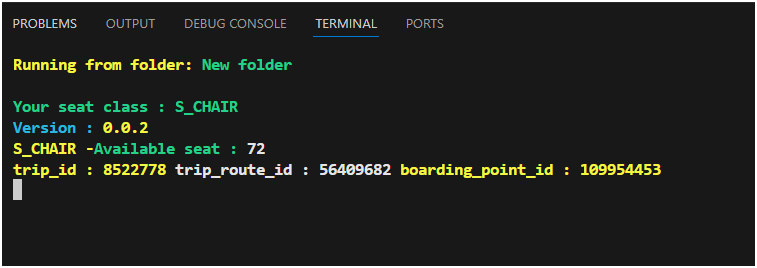
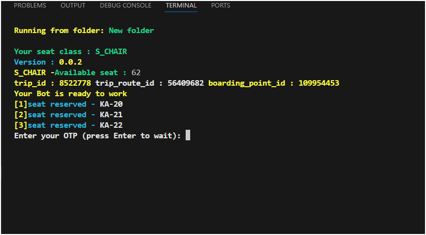
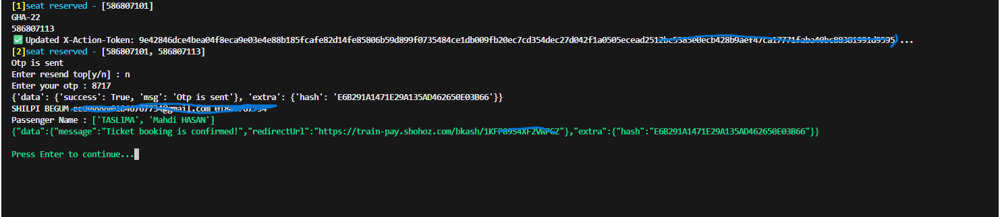
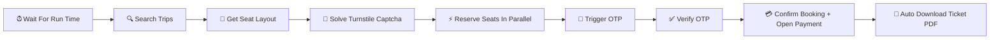

<div align="center">

# 🚆 Bangladesh Railway Ticket Auto-Booking Bot

### ⚡ Lightning-Fast | 🧠 Smart Captcha | 🎯 Seat-Precise | 🔐 Secure OTP

**An extraordinary high-performance automation engine that books Bangladesh Railway (eticket.railway.gov.bd / Shohoz) train tickets the instant they go on sale — faster than any human can blink.**

[](https://www.python.org/)
[]()
[]()
[]()
[]()
[]()

---

> 💡 *"Stop fighting the clock. Stop refreshing pages at 8 AM. Let the bot win the seat war for you."*

</div>

---

## ✨ Why This Bot Is Different

Most ticket bots break the moment Cloudflare Turnstile expires their token, or they crash when the server rate-limits them. **This one doesn't.**

🔥 **Built for the real world** — every error message, every Cloudflare challenge, every "ticket not available" race condition has been hunted down and fixed.

| 🎯 Feature | 🚀 What It Means For You |
|---|---|
| **Multi-threaded Turnstile Pool** | 3 background solvers keep 6 fresh tokens ready 24/7 — never wait, never expire |
| **Per-Seat Fresh Tokens** | Every reservation request gets its own unexpired token — zero `Invalid action token` errors |
| **Smart Seat Preference Engine** | Prioritize *your* favorite seat numbers, then fall back to any available seat |
| **Parallel Seat Reservation** | Reserves multiple seats in parallel using a thread pool — wins races against human clickers |
| **Scheduled Run Time** | Set it once, walk away — the bot wakes up at the exact second tickets open |
| **Auto OTP Resend** | If you miss the SMS, the bot re-requests OTP up to 3 times automatically |
| **Auto PDF Ticket Download** | After payment, your ticket PDF is downloaded and saved with a smart filename |
| **Rate-Limit Auto-Recovery** | Detects "wait X minutes Y seconds" responses and politely waits — no IP bans |
| **bKash / Card / Nagad Ready** | Whatever payment method your account uses, the bot opens the right gateway |

---

## 🎬 Live Demo — See It In Action

### 🚀 Step 1 — Bot Boots & Locks Onto The Trip
The instant you launch, the bot identifies your train, route, boarding point, and counts available seats in real time.

<div align="center">



*🟢 Seat class detected · Trip ID locked · Boarding point captured · 72 seats available*

</div>

---

### ⚡ Step 2 — Parallel Seat Reservation (Faster Than Human Clicks)
The bot fires multiple reservation requests in parallel, claiming your preferred seats before anyone else can scroll.

<div align="center">



*🔥 3 seats locked in milliseconds: **KA-20**, **KA-21**, **KA-22** — then waits for your OTP*

</div>

---

### ✅ Step 3 — OTP Verified → Ticket Booking Confirmed!
After OTP verification, the bot finalizes the booking and opens the **bKash payment gateway** instantly.

<div align="center">



*🎉 `"Ticket booking is confirmed!"` — Auto-redirects to bKash for payment*

</div>

---

### 📄 Step 4 — PDF Ticket Auto-Downloaded
The moment payment clears, your official ticket PDF is downloaded and saved with a smart, organized filename.

<div align="center">

📥 **[View Sample Ticket PDF](Image/ticket.pdf)**

</div>

---

### 💻 Terminal Output Preview

```
╔════════════════════════════════════════════════════════════╗
║  Running from folder: AC_B-D-3                             ║
║  Captcha Balance: 12.94 | IP: 103.137.67.242               ║
║  Seat class: AC_B                                          ║
║  Version: 0.0.4                                            ║
║  Your Bot is ready to work ✅                              ║
║  Waiting... 14s remaining                                  ║
║                                                            ║
║  trip_id: 8566632  route: 57904643  boarding: 110759229    ║
║  Eligible: 23 | Preferred: 4 | Others: 19                  ║
║  [1] seat reserved - KHA-3                                 ║
║  [2] seat reserved - KHA-7                                 ║
║                                                            ║
║  Enter your OTP (press Enter to wait): 5957                ║
║  ✅ OTP received, stopping resend                          ║
║  💳 Opening bKash payment gateway...                       ║
║  📄 PDF downloaded: 16_Dec_2026_SUBORNO_AC_B_ticket.pdf    ║
╚════════════════════════════════════════════════════════════╝
```

---

## 🧠 How It Works (The Magic Inside)



1. **Pre-arm phase** — Bot launches early, builds a pool of fresh Cloudflare Turnstile tokens.
2. **Countdown phase** — Idles until your exact scheduled `run_at` time.
3. **Strike phase** — The instant tickets open, it queries seat-layout, filters by your preferences, and fires parallel reservation requests with fresh tokens.
4. **Lock phase** — Triggers passenger-details OTP, you enter the SMS code, bot verifies.
5. **Pay phase** — Confirms booking, opens your payment gateway, polls purchase history, and downloads the PDF the moment payment completes.

---

## 🛠️ Quick Start

### 1️⃣ Install Python 3.10+
```bash
python --version  # Should be 3.10 or higher
```

### 2️⃣ Install Dependencies
```bash
pip install httpx 2captcha-python requests
```

### 3️⃣ Configure `user_data.json`
```json
{
  "token": "YOUR_RAILWAY_ACCESS_TOKEN",
  "d_ID": "YOUR_DEVICE_ID",
  "api_key": "YOUR_2CAPTCHA_API_KEY",
  "from_city": "Dhaka",
  "to_city": "Chattogram",
  "date_of_journey": "20-Dec-2026",
  "seat_class": "AC_B",
  "trip_number": "SUBORNO EXPRESS",
  "Seats_to_reserve": 2,
  "set_start": 1,
  "floor_name": "",
  "preferred_seat_numbers": ["KHA-3", "KHA-7"],
  "payment_method": 1,
  "run_at": "2026-12-15 08:00:00.000000",
  "info_user": [
    { "Name": "Your Name", "gender": "male", "passengerType": "Adult" }
  ]
}
```

### 4️⃣ Run It
```bash
python mian.py
```

The bot will sit quietly, top up its captcha pool, then strike at `run_at` time.

---

## 🎨 Smart Configuration

| 🔑 Key | 📝 Description | 💎 Example |
|---|---|---|
| `from_city` / `to_city` | Origin and destination stations | `"Dhaka"` → `"Chattogram"` |
| `seat_class` | Class to book | `AC_B`, `SNIGDHA`, `S_CHAIR`, `SHOVAN` |
| `trip_number` | Train name keyword (partial match OK) | `"SUBORNO"` |
| `Seats_to_reserve` | Number of seats to lock | `1` to `4` |
| `preferred_seat_numbers` | Priority list — bot grabs these first | `["KHA-3", "KHA-7"]` |
| `set_start` | Skip seat numbers below this | `1` |
| `floor_name` | Filter coaches by floor | `"upper"` or `""` |
| `payment_method` | Payment gateway selector | `1` = bKash |
| `run_at` | Exact strike time (microsecond precision) | `"2026-12-15 08:00:00.000000"` |

---

## 🚦 Status Codes Decoded

| 🔴 Error | 🟢 What The Bot Does |
|---|---|
| `TURNSTILE_VERIFICATION_FAILED` | Silently swaps in a fresh token and retries |
| `Invalid or expired action token` | Auto-rotates token from the pool |
| `Sorry! this ticket is not available` | Moves to the next seat instantly |
| `Maximum 4 seats already reserved` | Stops gracefully (server hard limit) |
| `Server Error 403` | Backs off 2 seconds and retries |
| `Rate limited X minutes Y seconds` | Counts down precisely and resumes |
| `Invalid User Access Token` | Halts and asks you to refresh login |

---

## ⚙️ Architecture Highlights

```
┌──────────────────────────────────────────────────────────┐
│  🧵 Thread 1-3:  Turnstile Solver Pool (always fresh)    │
│  🧵 Thread 4:    OTP Auto-Resender                       │
│  🧵 Thread 5+:   Parallel Seat Reservation Workers       │
│  🧵 Main:        Trip Search → Layout → Confirm → PDF    │
└──────────────────────────────────────────────────────────┘
```

- **TTL-bounded token pool** — every token is timestamped; anything older than 100s is dropped before use.
- **Thread-safe shared state** — all reservation lists protected by locks; no race condition can double-book.
- **Zero recursion** — flat `while True` retry loops mean unlimited resilience without stack overflow.
- **Boundary-only error handling** — internal helpers stay clean; only network edges catch exceptions.

---

## 🔒 Safety & Compliance

> ⚠️ **For personal use only.** This tool helps individuals reserve their own tickets faster — it does not bypass payment, security, or identity verification. You still pay through the official gateway. You still verify with your own phone's OTP. You still submit your real passenger details.

- ✅ Uses the **official Bangladesh Railway / Shohoz API** — no scraping, no DOM hacks.
- ✅ Captchas solved through **legitimate 2Captcha service** (you pay per solve).
- ✅ Respects server rate limits with intelligent backoff.
- ❌ Not affiliated with Bangladesh Railway or Shohoz.

---

## 📈 Roadmap

- [x] Multi-threaded Turnstile token pool
- [x] Per-seat fresh token rotation
- [x] Auto OTP resend
- [x] PDF auto-download
- [ ] Telegram bot notifications
- [ ] GUI desktop app (Electron / PyQt)
- [ ] Mobile companion app
- [ ] Multi-account orchestration
- [ ] Smart fare-class fallback

---

## 💬 Support & Contact

📧 **Need help, custom build, or premium edition?**

<div align="center">

[](mailto:xyzmahdi420@gmail.com)
[]()
[]()

</div>

---

## ⭐ Show Some Love

If this bot saved you from the 8 AM ticket war, drop a ⭐ on the repo — it really helps!

<div align="center">

**Built with ❤️ for Bangladeshi train travelers who refuse to lose the seat war.**

`Made in Bangladesh 🇧🇩`

</div>
